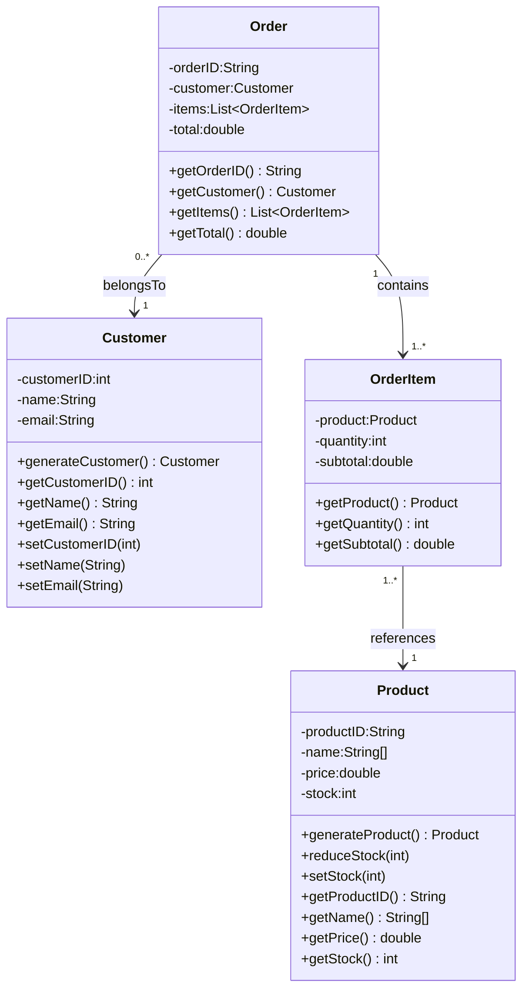

# Online Shop Simulation

## To Add
- Remove some hardcoded values for expenses, stock levels, processing times, etc.

- Add configuration file support (JSON/Properties) for easy adjustments. Also allow command-line to change stock values, expenses, processing times, etc.

- Customer demand/intelligence

    - Budget constraints: Customers have budgets that influence their purchasing decisions. Likeness of high budget is likely exponential.

    - Product preferences
        - Is new or popular
        - discounted items
        - product relations
        - Seasonal trends

### Hardcoded Values

#### Hardcoded Relationships

- Numbers of products

    * Increasing this value automatically increases the stores base *budget?* because of how product prices are generated. **Not realistic.**

    **SOLUTION:**

    - Decouple product count from store budget. Introduce a fixed budget or a budget based on realistic factors (e.g., market size, customer base).
    - Introduce *manefacure store* that supplies the products to the online shop. Manefacture store can have contracts with suppliers, different customs, import costs, etc.
    - Implement a more sophisticated pricing model that considers factors like demand, competition, and market trends rather than just random multipliers.


#### Main.java
- **56**: Number of products to generate
    - Code: `List<Product> products = generateProducts(10);`
    - Value: `10`

- **63**: Order generation interval (seconds)
    - Code: `final int ORDER_GENERATION_INTERVAL_SECONDS = 5;`
    - Value: `5` seconds

#### MonthlyReport.java
- **15-18**: Fixed monthly expenses (hardcoded)
    - `private static final double SALARIES = 50000;`
    - `private static final double RENT = 10000;`
    - `private static final double UTILITIES = 2000;`
    - `private static final double OTHER_EXPENSES = 5000;`

#### OrderProcessor.java
- **33**: Order processing time range
    - Code: `int processingTime = random.nextInt(1500) + 500;`
    - Range: `500-2000ms` (randomized)

- **9**: Thread pool size
    - Code: `private final ExecutorService executorService = Executors.newFixedThreadPool(10);`
    - Value: `10` threads

#### BusinessHours.java
- **6-7**: Business hours (hardcoded)
    - `public static final int OPEN_HOUR = 9;` (9 AM)
    - `public static final int CLOSE_HOUR = 17;` (5 PM)

#### TimeSimulator.java
- **6**: Default speed multiplier
    - Code: `private int speedMultiplier = 4;`
    - Value: `4x` (default)

- **7**: Valid speed multipliers
    - Code: `if (multiplier == 1 || multiplier == 4 || multiplier == 8 || multiplier == 32)`
    - Values: `1x, 4x, 8x, 32x`

#### Generators.java

**Hardcoded Customer Names:**
- **7-8**: First names array (14 names, some duplicated)
    ```java
    public static String[] firstNames = { "Simon", "Anna", "Peter", "Maria", "John", 
            "Anna", "Peter", "Maria", "John", "Linda", "James", "Susan", "Robert", "Karen" };
    ```

- **10-11**: Last names array (14 names)
    ```java
    public static String[] lastNames = { "Smith", "Johnson", "Williams", "Brown", "Jones", 
            "Garcia", "Miller", "Davis", "Rodriguez", "Martinez", "Hernandez", "Lopez", 
            "Gonzalez", "Wilson" };
    ```

- **13-14**: Email providers array (5 providers)
    ```java
    public static String[] randEmailProviders = { "@fmail.com", "@ahooy.com", "@inlook.com", 
            "@example.com", "@notmail.com" };
    ```

**Hardcoded Product Versions (with multipliers):**
- **16-26**: Product version modifiers (10 versions)
    ```java
    private static final Object[][] productVersion = {
            { "Lite", 0.6 },      { "Mini", 0.7 },      { "Go", 0.8 },
            { "Air", 0.85 },      { "Plus", 1.0 },      { "Prime", 1.2 },
            { "Pro", 1.3 },       { "Max", 1.5 },       { "Ultra", 1.8 },
            { "Edge", 1.9 }
    };
    ```

**Hardcoded Product Types (with multipliers and categories):**
- **28-41**: Product type modifiers (13 types)
    ```java
    private static final Object[][] productType = {
            { "Phone", 1.0, "Handhelds" },        { "Laptop", 7.5, "Computers" },
            { "Desktop", 10.0, "Computers" },    { "Tablet", 5.0, "Handhelds" },
            { "Headphones", 0.8, "Audio" },      { "Earbuds", 0.5, "Audio" },
            { "Camera", 1.4, "Imaging" },        { "Smart TV", 3.0, "Entertainment" },
            { "Smartwatch", 0.9, "Wearables" },  { "Speaker", 0.7, "Audio" },
            { "Monitor", 5.0, "Computers" },     { "Printer", 1.1, "Computers" },
            { "Router", 0.6, "Networking" }
    };
    ```

**Randomized Product Price (within hardcoded range):**
- **66**: Base price range
    - Code: `double basePrice = 50 + (80 - 50) * random.nextDouble();`
    - Range: `$50.00 - $80.00` (randomized)
    - Applied multipliers: `versionMod × typeMod × randomMod(0.90-1.00)`

**Randomized Product Stock:**
- **147**: Stock range
    - Code: `return random.nextInt(1, 21);`
    - Range: `1-20 units` (randomized per product)

**Randomized Customer Generation:**
- **53**: Customer name and email selection (randomized)
    - Selects random first name from `firstNames[]`
    - Selects random last name from `lastNames[]`
    - Selects random email provider from `randEmailProviders[]`

### Possible Config Values

#### BusinessHours
- Opening hour: `9` (9 AM)
- Closing hour: `17` (5 PM)
- Could support 24-hour mode with configuration

#### MonthlyReport Expenses
All currently hardcoded, candidates for configuration:
- `SALARIES`: `$50,000`
- `RENT`: `$10,000`
- `UTILITIES`: `$2,000`
- `OTHER_EXPENSES`: `$5,000`

#### TimeSimulator
- Speed multipliers: `1x, 4x, 8x, 32x` (hardcoded allowed values)
- Default speed: `4x`

#### Order Generation
- Product count: `10`
- Generation interval: `5 seconds`
- Items per order: `1-4` (randomized)
- Quantity per item: `1-3` (randomized)

#### Price Generation
- Base price floor: `$50.00`
- Base price ceiling: `$80.00`
- Random variation factor: `0.90 - 1.00` (9-10% adjustment)

#### MISC

##### MOVE 

    private void generateOrders
    private void checkMonthEnd
    private void handleUserCommands
    private Order createOrder
    private List<Product> generateProducts
    private boolean hasStock

## Changes from Version 7d63653

### Core Simulation Features Implemented

**TimeSimulator.java**
- Refactored to support configurable speed multipliers (1x, 4x, 8x, 32x)
- Added thread-safe time tracking with `AtomicBoolean` for proper concurrent access
- Implemented month-end detection for triggering monthly reports
- Added proper interrupt handling and shutdown mechanism
- Synchronized `getCurrentSimTime()` method for thread safety

**OrderProcessor.java**
- Implemented multi-threaded order processing with fixed thread pool (10 threads)
- Added `ConcurrentHashMap` for thread-safe active order tracking
- Business hours validation: processes orders immediately during hours, queues outside
- Simulated processing time (500-2000ms per order)
- Stock reduction for processed orders
- Proper error handling for insufficient stock scenarios

**BusinessHours.java**
- Implemented `ConcurrentLinkedQueue` for queuing orders outside business hours (9 AM - 5 PM)
- `processQueuedOrders()` automatically processes queued orders when business opens
- Queue size tracking via `getQueueSize()` method
- Thread-safe order queueing mechanism

**MonthlyReport.java**
- Complete monthly financial reporting system
- Tracks: total orders, revenue, average order value, product sales metrics
- Generates formatted reports with:
  - Revenue summary (total orders, revenue, average order value)
  - Top 5 best-selling products with quantities and revenue
  - Top 5 least-selling products for inventory analysis
  - Fixed monthly expenses (salaries: $50k, rent: $10k, utilities: $2k, other: $5k)
  - Net profit calculation
- Automatic reset for month-to-month tracking
- Getter methods for programmatic access to metrics

**Main.java**
- Complete multi-threaded simulation with 4 concurrent threads:
  - Time simulator thread (advances simulated time)
  - Order generation thread (creates random customer orders at intervals)
  - Month-end checker thread (monitors for month transitions)
  - Main UI thread (handles user commands)
- Interactive command system:
  - Speed control: `realtime`, `4x`, `8x`, `32x`
  - Reporting: `report` (generates current month report)
  - Monitoring: `queue` (shows queued orders), `time` (displays current sim time)
  - Control: `quit` (graceful shutdown)
- Order generation respects product stock levels
- Automatic month-end report generation with counter reset
- Proper thread lifecycle management and cleanup

### Technical Improvements

- **Concurrency**: Proper use of thread-safe collections (`ConcurrentHashMap`, `ConcurrentLinkedQueue`, `AtomicBoolean`)
- **Threading**: 4 independent threads for simulation, order processing, month-end checks, and user input
- **Thread Pool**: 10-thread executor for parallel order processing
- **Interrupt Handling**: Proper handling of `InterruptedException` with thread interruption flag
- **Synchronization**: Synchronized access to shared simulated time resource
- **Resource Management**: Try-with-resources for Scanner, proper executor shutdown

### Simulation Behavior

- Orders generated every 5 seconds (scaled by speed multiplier)
- Orders placed outside business hours (before 9 AM or after 5 PM) are queued
- Queued orders process automatically when business opens
- Each order takes 500-2000ms to process (simulated)
- Stock reduced for each processed item
- Monthly reports auto-generate at month-end with comprehensive metrics

---

# Feature Categorization

## Pricing & Profitability
**Initial:**
- [x] More realistic prices
*Fixed with modifiers, assigned products to map types*
- [ ] Cost/profit calculations (requires initial stock cost, import costs)

**Additional:**
- Taxes/VAT
- Discounts/coupons/promotions
- Tiered/customer-specific pricing
- Bundles/kits pricing
- Currency conversion
- Dynamic pricing
- Per-product gross margin and COGS tracking

## Inventory & Stock Management
**Initial:**
- Restocking
- Shipment in/out
- Stock-out loss tracking
- Restock report (below threshold)

**Additional:**
- Safety stock
- Backorders/reservations
- Purchase orders to suppliers
- Multi-warehouse
- Lot/serial tracking
- Expiration dates
- Stock audits/adjustments

## Orders & Fulfillment
**Initial:**
- Order processing status
- Returns

**Additional:**
- Partial fulfillment/split shipments
- Cancellations/refunds
- Shipping methods and tracking numbers
- Invoices/receipts
- Payment method simulation
- Preorder handling

## Customer & Accounts
**Initial:**
- Customer history
- Loyalty points
- Customer accounts
- Customer log file
- Per-customer totals (spent, orders)
- Email in order

**Additional:**
- Address book (billing/shipping)
- Segmentation
- GDPR (export/delete)
- Notification preferences
- Fraud checks
- Wishlists

## Reporting & Analytics
**Initial:**
- Order summary (total revenue, number sold, processed orders, avg order value)
- Per-product totals
- Customer totals
- Restock reports
- Stock-out loss
- Ads revenue

**Additional:**
- Dashboards/KPIs
- Time-series trends
- Cohort analysis
- Conversion rates
- CSV/JSON export
- Audit trails
- Profitability by product/category/customer

## Product Catalog & Variants
**Initial:**
- [x] Product type modifiers

**Additional:**
- Categories/tags
- Attributes/specs
- Images
- Bundles/kits
- Availability states (in stock, preorder, backorder)
- Search/filter

## Simulation & Randomization Controls
**Initial:**
- Shuffled product selection
- Customer generator pick from recent customers OR new customers. Does not need customer logging can be decided with simple boolean.
- More dynamic product/stock creation, ensure variety and min by category

**Additional:**
- Seedable RNG
- Scenario profiles (holiday sale, promo spikes)
- Arrival rate distributions (Poisson)
- Lead times/service times
- Configurable restock schedules

## Architecture & Technical Foundation
**Additional:**
- Persistence (SQLite/H2)
- Repositories/DAOs
- REST API scaffolding
- Logging (SLF4J/Logback)
- Error handling
- Unit/integration tests
- Config files
- Concurrency/thread-safety
- CI tasks
- CLI/admin console

## Farfetched
**Initial:**
- Multi-thread orders from multiple customers
- Warehouse space vs stock volume and price/m²
- Logistics simulation with delivery times/costs
- Cost modeling for returns/restocking/employees/servers/electricity

**Additional:**
- Demand forecasting (ML)
- Dynamic pricing via reinforcement learning
- Route optimization
- Discrete-event/agent-based simulation
- Monte Carlo scenarios
- Event-driven architecture (Kafka)
- Microservices
- Cloud autoscaling
- Real-time dashboards
- Optimization models for restock (linear programming)


## UML Class Diagram

