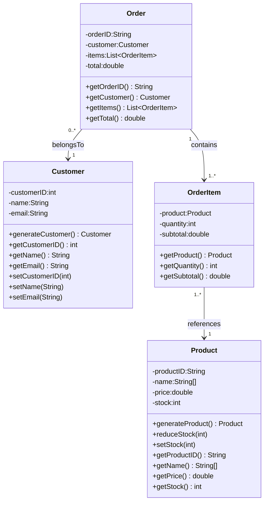

# Feature Categorization

## Pricing & Profitability
**Initial:**
- [x] More realistic prices
*Fixed with modifiers, assigned products to map types*
- [ ] Cost/profit calculations (requires initial stock cost, import costs)

**Additional:**
- Taxes/VAT
- Discounts/coupons/promotions
- Tiered/customer-specific pricing
- Bundles/kits pricing
- Currency conversion
- Dynamic pricing
- Per-product gross margin and COGS tracking

## Inventory & Stock Management
**Initial:**
- Restocking
- Shipment in/out
- Stock-out loss tracking
- Restock report (below threshold)

**Additional:**
- Safety stock
- Backorders/reservations
- Purchase orders to suppliers
- Multi-warehouse
- Lot/serial tracking
- Expiration dates
- Stock audits/adjustments

## Orders & Fulfillment
**Initial:**
- Order processing status
- Returns

**Additional:**
- Partial fulfillment/split shipments
- Cancellations/refunds
- Shipping methods and tracking numbers
- Invoices/receipts
- Payment method simulation
- Preorder handling

## Customer & Accounts
**Initial:**
- Customer history
- Loyalty points
- Customer accounts
- Customer log file
- Per-customer totals (spent, orders)
- Email in order

**Additional:**
- Address book (billing/shipping)
- Segmentation
- GDPR (export/delete)
- Notification preferences
- Fraud checks
- Wishlists

## Reporting & Analytics
**Initial:**
- Order summary (total revenue, number sold, processed orders, avg order value)
- Per-product totals
- Customer totals
- Restock reports
- Stock-out loss
- Ads revenue

**Additional:**
- Dashboards/KPIs
- Time-series trends
- Cohort analysis
- Conversion rates
- CSV/JSON export
- Audit trails
- Profitability by product/category/customer

## Product Catalog & Variants
**Initial:**
- [x] Product type modifiers

**Additional:**
- Categories/tags
- Attributes/specs
- Images
- Bundles/kits
- Availability states (in stock, preorder, backorder)
- Search/filter

## Simulation & Randomization Controls
**Initial:**
- Shuffled product selection
- Customer generator pick from recent customers OR new customers. Does not need customer logging can be decided with simple boolean.
- More dynamic product/stock creation, ensure variety and min by category

**Additional:**
- Seedable RNG
- Scenario profiles (holiday sale, promo spikes)
- Arrival rate distributions (Poisson)
- Lead times/service times
- Configurable restock schedules

## Architecture & Technical Foundation
**Additional:**
- Persistence (SQLite/H2)
- Repositories/DAOs
- REST API scaffolding
- Logging (SLF4J/Logback)
- Error handling
- Unit/integration tests
- Config files
- Concurrency/thread-safety
- CI tasks
- CLI/admin console

## Farfetched
**Initial:**
- Multi-thread orders from multiple customers
- Warehouse space vs stock volume and price/m²
- Logistics simulation with delivery times/costs
- Cost modeling for returns/restocking/employees/servers/electricity

**Additional:**
- Demand forecasting (ML)
- Dynamic pricing via reinforcement learning
- Route optimization
- Discrete-event/agent-based simulation
- Monte Carlo scenarios
- Event-driven architecture (Kafka)
- Microservices
- Cloud autoscaling
- Real-time dashboards
- Optimization models for restock (linear programming)

## UML Class Diagram

